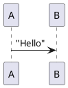

You can write PlantUML code directly inside of code blocks. The rendered diagram will show up
immediately after the code block default. For example, if I write the codeblock:

````markdown

````

it is rendered thusly:


It's also possible to refer to external diagram files with the `.puml` suffix as if they were
images, and they'll be rendered directly into the document. So that I can write:
`` (referring to a hello.puml file in the same directory as my markdown), and
it will show up like this:


