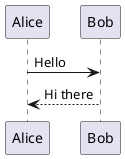

# @interrogate/remark-plugin-plantuml

[![NPM version][npm-badge]][npm-url] [![License: MIT][license-badge]][license-url]

Process PlantUML diagrams in markdown with [Remark][remark].

## Quick reference

- **Package**: [@interrogate/remark-plugin-plantuml][npm-url]
- **Maintained by**: [interrogate-io](https://github.com/interrogate-io)
- **Issues**: [GitHub Issues](https://github.com/interrogate-io/interrogate/issues)

## Installation

```bash
npm install @interrogate/remark-plugin-plantuml
```

## What is this?

A [Remark][remark] plugin that processes PlantUML code blocks in markdown and attaches diagram data
as additional properties. It's designed to work with
[@interrogate/rehype-plugin-plantuml][rehype-plantuml] to generate the final HTML output.

## When should I use this?

- When you need to include PlantUML diagrams in your markdown documentation
- When you're processing PlantUML syntax during the markdown transformation phase
- When generating documentation with PlantUML diagrams (e.g., in Docusaurus)
- As part of a complete markdown-to-HTML pipeline using Remark and Rehype

## Usage

Basic usage with unified:

```js
import remarkPlantuml from "@interrogate/remark-plugin-plantuml"
import { unified } from "unified"
import remarkParse from "remark-parse"
import remarkRehype from "remark-rehype"

const processor = unified().use(remarkParse).use(remarkPlantuml).use(remarkRehype)
```

### Example: Inline PlantUML

````markdown
Here's a sequence diagram:


````

````

### Example: External PlantUML Files

```markdown

````

## API

### `remarkPlantuml([options])`

Transform PlantUML code blocks in markdown and attach diagram data as properties for consumption by
rehype plugins. Options documentation coming soon.

## License

[MIT][license-url] © James Lafferty

[npm-badge]: https://img.shields.io/npm/v/@interrogate/remark-plugin-plantuml.svg
[npm-url]: https://www.npmjs.com/package/@interrogate/remark-plugin-plantuml
[license-badge]: https://img.shields.io/npm/l/@interrogate/remark-plugin-plantuml.svg
[license-url]: https://github.com/interrogate-io/interrogate/blob/main/LICENSE
[remark]: https://github.com/remarkjs/remark
[rehype-plantuml]: https://www.npmjs.com/package/@interrogate/rehype-plugin-plantuml
